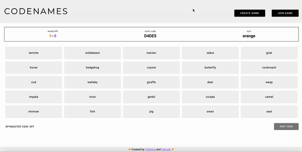

# Codenames

🔸 by [Elisheva](https://github.com/elishevaelbaz) and [Hannah](https://github.com/hkofkin)🔸

Codenames is a multiplayer single page application (SPA) based on [Czech Games's Codenames](https://codenamesgame.com/) where users compete by guessing words from the board based on their teammate’s one-word clues.

Players can invite friends to play with them by giving them their unique room code.  

### Basic rules:

Players split into 2 teams, orange and purple.  
Each team designates a 'spymaster' who will be giving clues to their teammates for the entire round. 
The spymasters of each team click 'spymaster view' on their own screen to see which words they will attempt to get their teammates to guess.

The spymasters from each team take turns to provide a one-word clue and the number of cards they feel it relates to. Using this clue, the other players on the team must pick which word cards from the board they think the spymaster is hinting at. 

If a player chooses a card that doesn’t correspond to one of their own, that team’s turn instantly ends. Any cards corresponding to the opponent team, result in the opposing team scoring. If the hidden bomb (red card) is chosen, the active team immediately loses the game. 
Otherwise, the winning team is whichever side successfully guesses all their words first.

View the official rules [here](https://czechgames.com/files/rules/codenames-rules-en.pdf)

### Supported features
Users can:
- create a game
- join an existing game
- enjoy multiplayer gameplay in real time via websockets
- create a new round (in the same game room) once a round ends

### Built with

- [Frontend:](https://github.com/elishevaelbaz/codenames-frontend) JavaScript   
- [Backend:](https://github.com/elishevaelbaz/codenames-backend) Ruby On Rails, PostgreSQL  

### Getting started
__To run on your local machine:__  

Prerequisites:
- Ruby on Rails
- VS code with [Live Server](https://marketplace.visualstudio.com/items?itemName=ritwickdey.LiveServer) extension
- PostgreSQL

Instructions:  
Clone both the [frontend](https://github.com/elishevaelbaz/codenames-frontend) and the [backend](https://github.com/elishevaelbaz/codenames-backend) repositories onto your machine using `git clone`.  

`cd` into the backend repository  
Run `bundle install` to download the necessary gems.  
Run `rails db:create && rails db:migrate` to create the database and the migrations.  
Run `rails db:seed` to seed the database.  
Run `rails s` to start the rails server.

`cd` into the frontend repository:  
Install Live Server extension in VS Code.
Click 'Go Live' in the bottom right corner of the VS Code editor (if you don't see this, make sure you have the Live Server extension installed).
This will run the application on a local port and open it in your default browser.